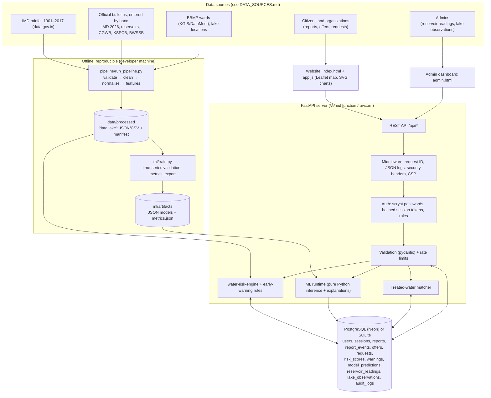

# JalSetu architecture

## Layers

| Layer | What | Files |
| --- | --- | --- |
| Ingestion and validation | Hand-entered official figures and downloaded datasets, validated with row-level reports; invalid records stop the pipeline | `pipeline/*.py`, `data/raw/` |
| Data lake | Deterministic processed files with SHA-256 manifest | `data/processed/` |
| Database | Versioned migrations (`schema_migrations`), the same SQL on SQLite and Postgres, advisory lock on Postgres | `app/db.py` |
| Analytics | Rainfall anomaly, trend, moving average, IMD categories | `pipeline/rainfall.py`, `/api/rainfall` |
| ML engine | Trained offline; exported JSON; pure-Python inference; predictions logged | `ml/`, `app/ml_runtime.py` |
| Risk engine | Configurable weighted index + warning rules + snapshots | `app/risk.py`, `config/risk_config.json` |
| API | 57 REST endpoints, JSON errors, status codes, OpenAPI at `/docs`, offline list at `/api` | `app/main.py`, `app/routes_*.py` |
| Auth | citizen / organization / admin; admin created from environment variables | `app/auth.py` |
| Frontend | Vanilla JS; no build step; Leaflet 1.9.4 bundled locally; SVG charts | `static/` |
| Observability | JSON log per request (request ID, status, ms), error references, health endpoint (DB, schema, data and model versions), audit log | `app/common.py`, `/api/health`, `/api/admin/*` |

## Why this stack (and not more)

- **FastAPI + Postgres**: one small service, already deployed on Vercel + Neon. It needs no message queue and no microservices.
- **Vanilla JS**: the site is ~1,500 lines of client code, and a framework would add a build step without adding features.
- **Pure-Python inference**: scikit-learn and numpy (~100 MB) stay out of the serverless bundle. Equivalence is tested.
- **Leaflet**: an open-source map library, bundled so the map works without a CDN (OpenStreetMap tiles still need internet).

## Request flow: submitting a report

1. The browser shrinks the photo, then POSTs a multipart form with the category and an area or map point.
2. The server validates the category, location (inside Bengaluru; ward found by point-in-polygon), tanker price and size, and the rate limit.
3. It re-encodes the photo with Pillow, which blocks non-images, files over 8 MB and images over 60 megapixels (checked from the header before decoding).
4. Optional: AI checks the photo. On any failure the report still saves, marked "not checked".
5. The server inserts the report as SUBMITTED, adds a `report_events` row, and writes a log line.
6. An admin moves it to UNDER_REVIEW, then VERIFIED or REJECTED, then RESOLVED. Transitions are allowed by a state machine, and every change is written to the audit log.
7. Verified reports raise the community component of the risk score; the input hash changes, so a new `risk_scores` snapshot is stored.
