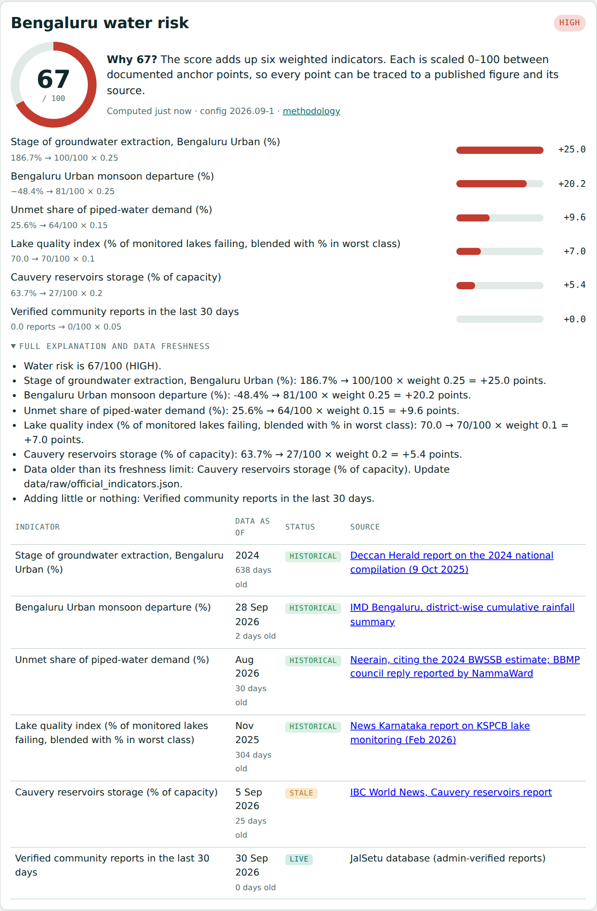
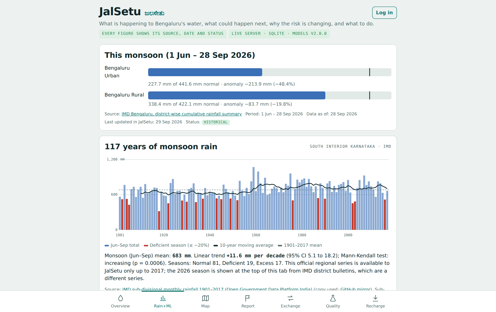
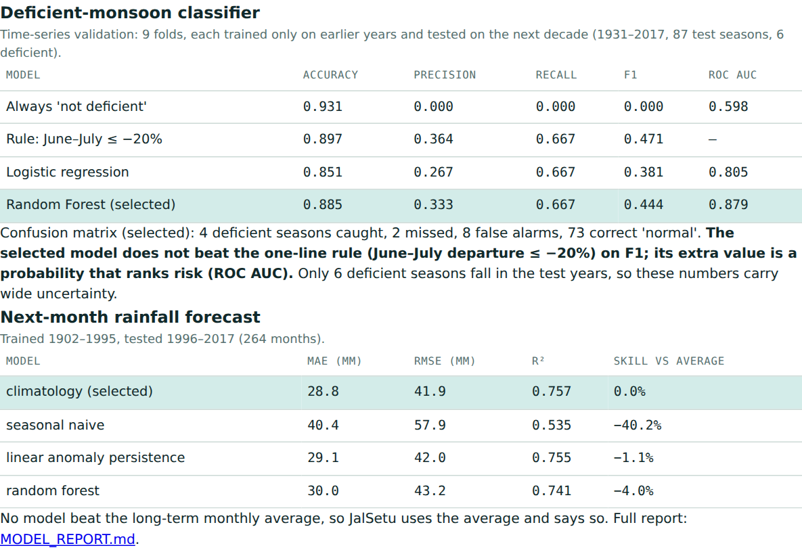
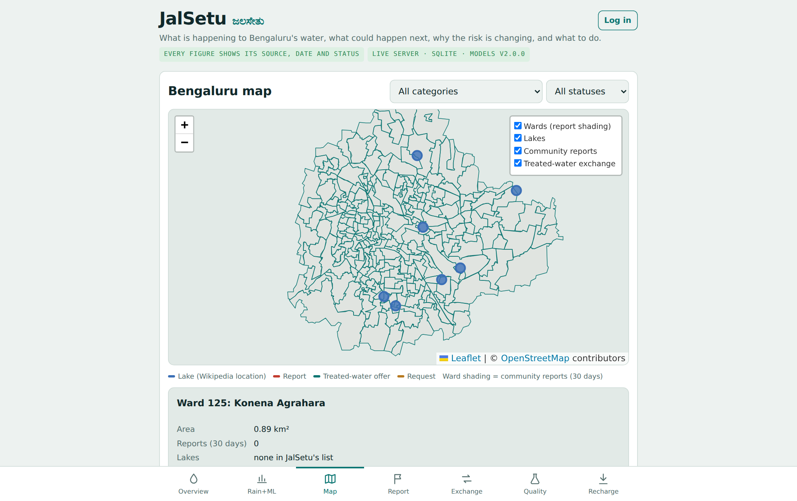
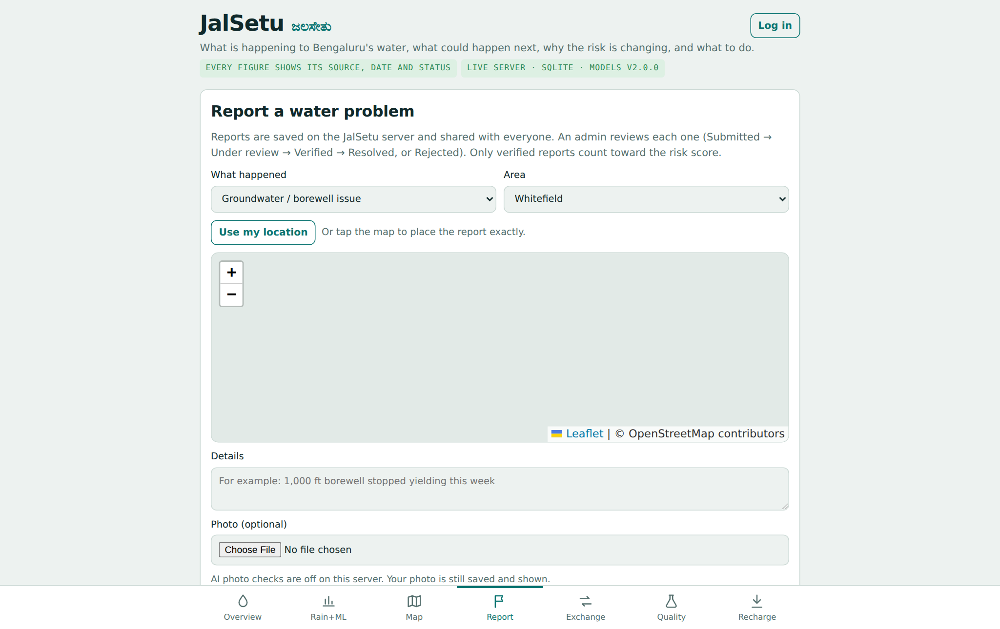
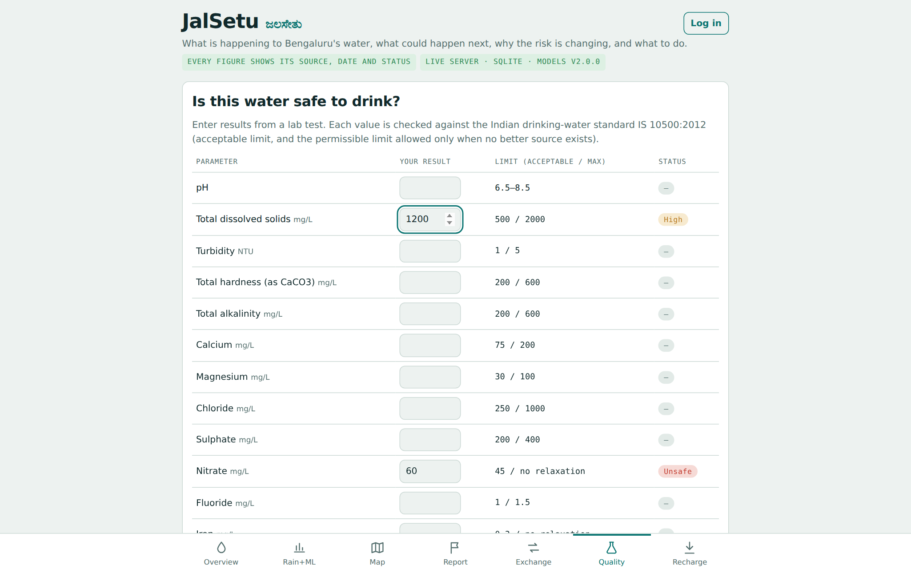
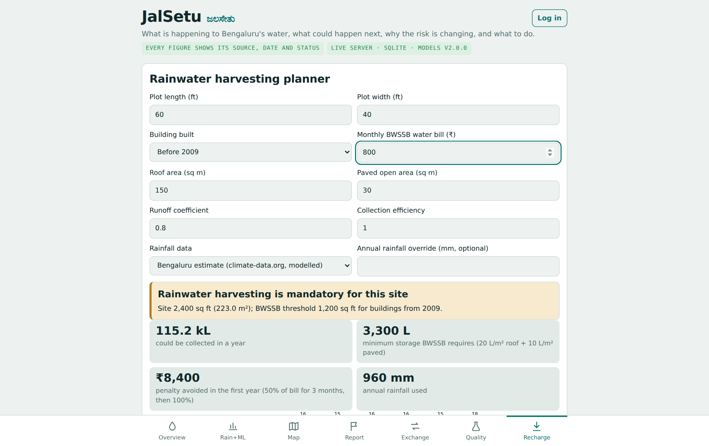
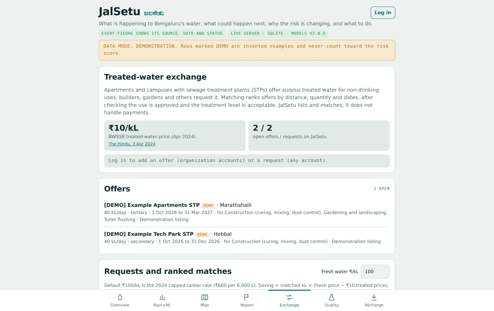
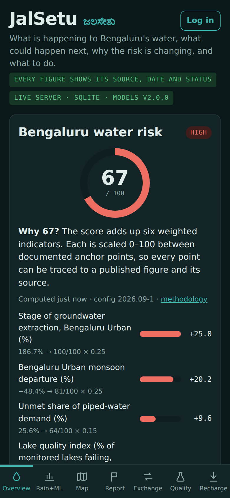
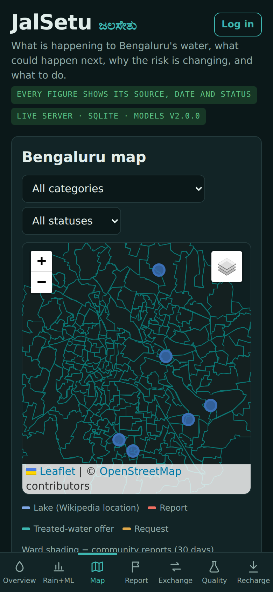

# JalSetu (ಜಲಸೇತು): water security for Bengaluru

**Live:** https://jalsetu-smoky.vercel.app · **Admin:** [`/admin`](https://jalsetu-smoky.vercel.app/admin) · **API:** [`/api`](https://jalsetu-smoky.vercel.app/api) (list) and [`/docs`](https://jalsetu-smoky.vercel.app/docs) (interactive)

Bengaluru is short of water on several fronts at once. The official CGWB 2024 assessment puts Bengaluru Urban's groundwater extraction at **186.7%** of recharge. This monsoon the district received **48% less rain than normal** (IMD, 1 Jun – 28 Sep 2026). Piped supply (~1,935 MLD) is below demand (~2,600 MLD), and none of 149 monitored lakes met KSPCB class A–C. These facts sit in separate IMD, CGWB, KSPCB and BWSSB documents. Citizens can't turn them into a decision, and what communities know (dry borewells, tanker prices) isn't recorded anywhere.

JalSetu is a working prototype of a data-driven water-security and early-warning platform. It answers four questions: **what is happening** to the city's water, **what could happen next**, **why the risk is changing**, and **what to do**. It combines published data, an explainable risk score, machine learning with honest evaluation, a ward map, early warnings, community reports reviewed by an admin, and a treated-water exchange.

> **Data status:** every figure shows its source, date and status. Official figures are entered from published bulletins, and the pipeline checks their provenance. **Nothing is presented as a live government feed.** Demo mode (`JALSETU_DEMO=1`) adds invented rows marked DEMO, which never count toward the score.


## What it does

| Module | What works | Data status |
| --- | --- | --- |
| Overview | Risk score 0–100 with six weighted, explained components; data freshness; early warnings with triggers and actions; 8 indicator cards with source, period, dates, status; risk history | Official/published (historical) + live DB |
| Rainfall analytics | 117-year (1901–2017) monsoon chart, anomalies (mm and %), IMD categories, 10-year moving average, OLS trend with CI, Mann-Kendall test, monthly anomaly chart per year | IMD 1901–2017 (historical, regional) |
| ML | Deficient-monsoon classifier with per-prediction explanation; forecaster (climatology won); Isolation Forest unusual-month detector; full metrics shown in the app | Trained on IMD data; see [MODEL_REPORT.md](MODEL_REPORT.md) |
| Map (GIS) | 243 BBMP wards, lakes, reports, treated-water offers and requests; layer toggles, category and status filters, ward click panel, ward shading by report count | KGIS/DataMeet, Wikipedia. Ward risk is shown as **unavailable**, not faked |
| Reservoirs | Latest per reservoir, % full, trend when two or more readings exist, admin ingestion with source | News report of official figures |
| Groundwater | Official extraction stage (real) shown separately from the modelled city water balance (estimate) | CGWB 2024 / WELL Labs |
| Lakes | List, ward, location source, city quality summary, admin-added observations | KSPCB summary; per-lake series unavailable |
| Community reports | 7 categories, area or exact map point or GPS, photo, status workflow SUBMITTED → UNDER_REVIEW → VERIFIED → RESOLVED / REJECTED, history; reporters can delete their own reports | Live DB |
| Treated-water exchange | Organization offers (quantity, treatment level, BOD/TSS, dates, approved uses); requests (quantity, dates, purpose, minimum treatment); ranked matching; savings; unmet demand | Live DB; ₹10/kL BWSSB price |
| Water quality | 18 IS 10500:2012 parameters → Safe / High / Unsafe with explanation | BIS standard |
| Rainwater harvesting | BWSSB mandatory rule, storage, monthly and annual harvest (rainfall × area × runoff × efficiency), penalty avoided, choice of rainfall series | BWSSB rules; rainfall options labelled |
| Accounts and admin | Citizen / organization / admin roles; admin dashboard: report review, delete report or photo, users and roles, warnings, data freshness, API health, ML info, predictions, audit log, reservoir ingestion | – |

## Screenshots

Taken from the real app running locally. The map tiles and web font need internet access, which the machine that took them didn't have. That is why the map shows ward outlines on a plain background.

| | |
| --- | --- |
|  Every point of the score traced to its source and date |  Early warnings with the rule that fired |
|  117 years of IMD monsoon rain, trend and significance test |  ML prediction for 2002, with the contribution of each input |
|  Honest evaluation: the model is compared with a simple rule and an average |  243 BBMP wards and 7 lakes; click a ward for its details |
|  Community report with photo and exact location |  IS 10500:2012 check: nitrate 60 mg/L is unsafe |
|  Rainwater-harvesting planner with the BWSSB rule |  Treated-water exchange (demo mode: rows marked DEMO) |
|  Admin review, status workflow and delete (demo mode) |   Phone, dark mode |

## Architecture

**Real data → validation → processing → analytics → explainable risk engine → ML (with honest evaluation) → GIS → early warnings → actions.** Diagram and request flow: [ARCHITECTURE.md](ARCHITECTURE.md).

| Area | Technology | Why |
| --- | --- | --- |
| Server | Python, FastAPI, Pydantic | Validation built in, OpenAPI docs |
| Database | PostgreSQL on Neon (production), SQLite (local); psycopg 3 | Same SQL on both; versioned migrations |
| Images | Pillow | Uploads re-encoded to JPEG; size and dimension limits |
| ML (offline) | scikit-learn 1.5.2, numpy | Training only; models exported to JSON, run in pure Python |
| Frontend | Vanilla JS, SVG charts, Leaflet 1.9.4 (bundled) | No build step; strict Content Security Policy |
| Optional AI | Anthropic API | Photo checks; everything works without it |
| Tests | pytest, Playwright, node:test | Unit, integration, browser |
| Quality | ruff (incl. security rules), mypy | Lint and type checking |
| Hosting | Vercel (`api/index.py`) | Serverless; photos are stored in the database, not on disk |

## Run it

Needs Python 3.10+.

```
pip install -r requirements.txt
ADMIN_EMAIL=you@example.com ADMIN_PASSWORD='a-long-password' uvicorn app.main:app --reload
```

Open http://localhost:8000, and http://localhost:8000/admin for the admin dashboard. Add `JALSETU_DEMO=1` to see labelled demonstration rows.

### Environment variables ([.env.example](.env.example))

| Variable | Purpose |
| --- | --- |
| `DATABASE_URL` | Postgres; empty = SQLite |
| `ADMIN_EMAIL`, `ADMIN_PASSWORD` | Creates the admin account (password 8+ characters). More admins can be made from the dashboard. |
| `ANTHROPIC_API_KEY` | Optional AI |
| `JALSETU_DEMO=1` | Demo rows |
| `CORS_ORIGINS` | Other sites allowed to call the API |
| `JALSETU_WRITE_LIMIT`, `JALSETU_LOGIN_LIMIT` | Rate limits |

### Deploy (Vercel + Neon)

1. Push to GitHub. Vercel builds `api/index.py` (`vercel.json`); the bundle contains no ML libraries.
2. Storage → Neon Postgres → connect. This sets `DATABASE_URL`; migrations run automatically on first start.
3. Settings → Environment Variables: set `ADMIN_EMAIL` and `ADMIN_PASSWORD`; optionally `ANTHROPIC_API_KEY`.
4. Redeploy. Check `/api/health` (`"database":"postgres"`) and `/api/admin-setup-status` (never shows the password).

Also works on Render (`render.yaml`) or Docker (`Dockerfile`).

### Data and models

```
python pipeline/run_pipeline.py            # rebuild data/processed (deterministic, byte-identical reruns)
pip install -r requirements-ml.txt
python ml/train.py                         # retrain and re-evaluate; exports JSON to ml/artifacts
```

## Tests

```
pip install -r requirements-dev.txt
pytest                                     # backend, pipeline, ML and browser end-to-end tests
node --test static/js/lib.test.js          # frontend unit tests
ruff check . && python -m mypy             # lint and types
```

Latest run (30 Sep 2026):

- **pytest:** 127 passed, including 9 browser end-to-end tests. The 118 non-browser tests also pass on PostgreSQL 16.
- **node:** 9 passed.
- **ruff and mypy:** clean.
- **QA script** (`scripts/qa_audit.py`, local server only): 64 of 64 checks passed on SQLite and on PostgreSQL 16. It covers accounts, sessions, admin authorization, report review and deletion, photo upload and removal, and persistence across a restart.

Details, and the failing cases the system handles: [TESTING.md](TESTING.md).

## Documentation

| Document | Contents |
| --- | --- |
| [docs/PROJECT_REPORT.md](docs/PROJECT_REPORT.md) ([PDF](docs/JalSetu_Project_Report.pdf)) | Complete project report: problem, gap, objectives, design, results, evaluation, limitations |
| [ARCHITECTURE.md](ARCHITECTURE.md) | Components, request flow, database |
| [DATA_SOURCES.md](DATA_SOURCES.md) | Every dataset: source, URL, period, retrieval date, status, processing, limitations |
| [MODEL_REPORT.md](MODEL_REPORT.md), [ML_MODEL_CARD.md](ML_MODEL_CARD.md) | ML method, validation, metrics, baselines, intended use |
| [docs/water-risk-methodology.md](docs/water-risk-methodology.md) | Risk score formula, weights, anchor points, warning rules |
| [docs/water-quality-standards.md](docs/water-quality-standards.md) | IS 10500:2012 limits used |
| [docs/rainwater-harvesting-methodology.md](docs/rainwater-harvesting-methodology.md) | Harvest formula and BWSSB rules |
| [API.md](API.md) | All 57 endpoints (generated from the OpenAPI schema) |
| [SECURITY.md](SECURITY.md) | Threat model, authentication, uploads, headers |
| [TESTING.md](TESTING.md) | Test suites and what they cover |
| [AUDIT.md](AUDIT.md) | Audit of version 1 and what changed in version 2 |
| [DEMO_SCRIPT.md](DEMO_SCRIPT.md) | 5-minute demo and what to do if something fails |
| [CLAUDE.md](CLAUDE.md) | Rules for working on this repository with Claude Code |

## Repository layout

```
jalsetu/
  api/index.py          Vercel entry point
  app/                  FastAPI server
    main.py             app setup, security headers, health, startup and migrations
    auth.py             accounts, scrypt hashing, sessions, roles, admin bootstrap
    routes_data.py      read APIs: risk, rainfall, ML, reservoirs, groundwater, lakes, GIS
    routes_community.py accounts, community reports and photos, treated-water exchange
    routes_admin.py     admin: review, delete, users and roles, ingestion, audit log
    risk.py             explainable risk score and early-warning rules
    ml_runtime.py       pure-Python inference and explanations from exported models
    db.py               SQLite/PostgreSQL adapter and versioned migrations
  config/               risk weights and anchor points (risk_config.json)
  data/raw/             original datasets (IMD, KGIS wards, lakes, official indicators)
  data/processed/       validated, processed outputs + manifest with SHA-256 hashes
  pipeline/             reproducible data pipeline (stdlib only)
  ml/                   feature building, training, evaluation, export; artifacts/*.json
  static/               website and admin dashboard (HTML, CSS, vanilla JS, Leaflet)
  tests/                pytest suites and Playwright end-to-end tests
  scripts/              API doc generator, black-box QA script
  docs/                 project report, methodologies, screenshots
```

## Known limitations

- **No live feeds.** Official figures are entered by hand; there are no live government feeds and no IoT sensors.
- **Secondary sources.** Some official figures come from news reports of them: reservoir levels, the CGWB stage, the KSPCB summary.
- **Historical rainfall.** It is regional (South Interior Karnataka) and the official series available ends in 2017; the models cannot see 2018–2026.
- **ML value.** The classifier doesn't beat a simple rule on F1, and its probabilities are uncalibrated; next-month forecasting has no skill over the average. Both are stated in the app.
- **No ward risk.** No ward-level risk, rainfall or groundwater data is public, so none is shown.
- **Limited lake data.** Only 7 lakes have locations, and none has a per-lake quality series yet.
- **Mixed dates.** Inputs to the risk score come from different dates; each component's age is displayed.
- **Unverified organizations.** Organizations are self-declared. There is no email verification or password reset.
- **Per-instance rate limits.** On serverless, each instance counts separately.
- **Map tiles need internet.** OpenStreetMap tiles need a connection; the ward outlines don't.
- **Arsenic limit to recheck.** Confirm the arsenic permissible limit against the latest BIS amendment.

## Future work

- **Better data:** KSNDMC reservoir bulletins and IMD daily district rainfall, ingested automatically where their terms allow; CGWB observation wells mapped to wards (which would make a ward risk layer possible); KSPCB monthly lake reports per lake.
- **Better models:** retrain on official data after 2017 (IMD) and probability calibration.
- **Accounts:** httpOnly cookie sessions, organization verification, password reset, and Kannada language support.
