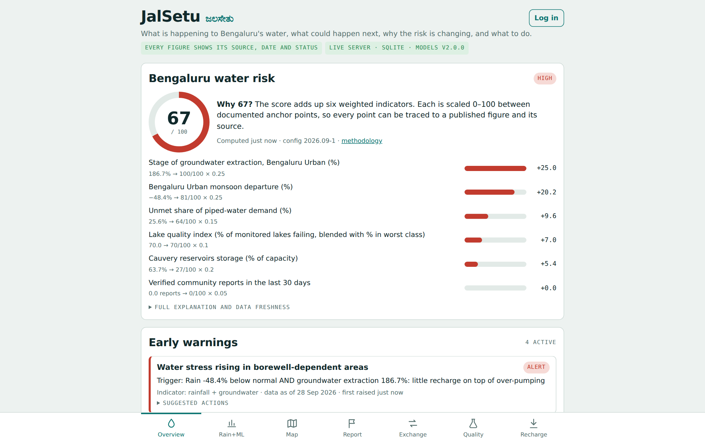
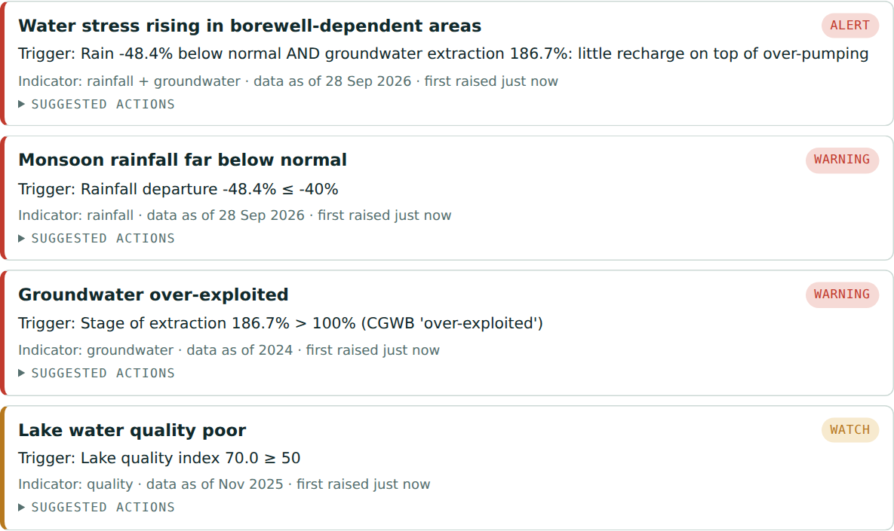
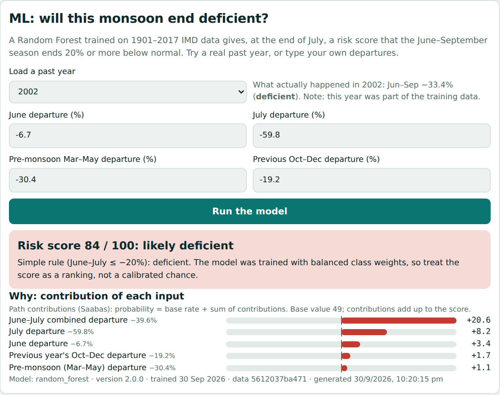
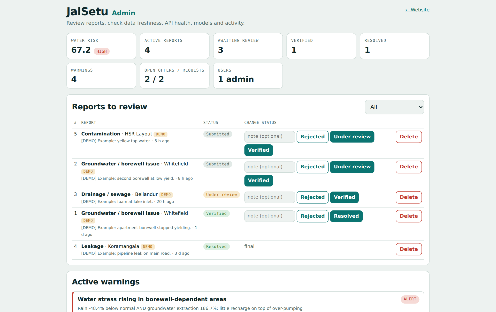

**Live system:** https://jalsetu-smoky.vercel.app · **Source code:** https://github.com/mohammedasim-ee/jalsetu

## Abstract

Bengaluru faces several water stresses at once: groundwater is extracted at 186.7% of recharge (CGWB 2024), the 2026 monsoon was 48.4% below normal in Bengaluru Urban (IMD, to 28 September), piped supply of about 1,935 MLD falls short of about 2,600 MLD of demand, and none of 149 monitored lakes meets KSPCB class A–C. These facts are published separately by different agencies and are not turned into anything a resident, planner or apartment association can act on.

JalSetu is a working web platform that brings them together. It validates published data through a reproducible pipeline and combines six indicators into an explainable 0–100 risk score (currently **67.2, HIGH**). Eight early-warning rules then turn the data into warnings with suggested actions. It analyses 117 years of IMD monsoon rainfall and evaluates machine-learning models honestly against simple baselines. It maps 243 BBMP wards. Citizens can file reports with photos that an admin reviews through a state machine. Surplus treated sewage water is matched with non-drinking uses. It also checks water against IS 10500:2012 and plans rainwater harvesting under BWSSB rules.

The system is deployed on Vercel with PostgreSQL (Neon). It is covered by 127 automated Python tests (including 9 browser end-to-end tests), 9 frontend tests, and a 64-check black-box QA script.

## 1. Problem

| Stress | Evidence | Source |
| --- | --- | --- |
| Groundwater | Stage of extraction **186.7%** in Bengaluru Urban ("over-exploited" above 100%); 6,900 of 13,900 city borewells dried up in 2024 | CGWB 2024 assessment; statement reported by SANDRP |
| Rainfall | 2026 monsoon **−48.4%** in Bengaluru Urban (227.7 mm of 441.6 mm normal, 1 Jun – 28 Sep) | IMD Bengaluru district summary |
| Supply | ~1,935 MLD supplied vs ~2,600 MLD demand: **25.6% unmet** | BBMP council reply; BWSSB estimate |
| Lakes | **0 of 149** lakes in class A–C; about 40% in class E | KSPCB monitoring, 2025 |
| Sewage | 580 of 2,300 MLD untreated | SANDRP |

Full provenance for every figure is in [DATA_SOURCES.md](../DATA_SOURCES.md).

## 2. The gap

- **Fragmented data.** Rainfall, reservoirs, groundwater and lake quality are published by different bodies (IMD, KSNDMC, CGWB, KSPCB, BWSSB) as PDFs, bulletins and news reports, on different dates. Nothing combines them into one picture of risk.
- **No explanation.** Even where a figure is published, nobody says what it means for the city's overall water situation or which factor is driving it.
- **No early warning linked to action.** A low monsoon and over-pumping together mean borewell failure, but no public tool raises that combined warning with practical steps.
- **Community knowledge is lost.** Dry borewells, contamination and tanker prices are known to residents but not recorded, verified or mapped.
- **Treated water is wasted.** Apartments and campuses with sewage treatment plants have surplus treated water, while builders and gardens use fresh water or tankers. There is no simple way to match the two.
- **Honesty about data.** Many dashboards present estimates as facts. JalSetu labels every figure with its source, date and status, and shows "unavailable" rather than inventing data (for example, there is no ward-level risk because no ward-level data is public).

## 3. Objectives

1. Collect, validate and document real published data, with provenance for every figure.
2. Compute a transparent risk score in which every point can be traced to a source.
3. Raise early warnings from documented rules, each with a trigger and suggested actions.
4. Apply machine learning where it helps, evaluated honestly against simple baselines, and say so where it doesn't help.
5. Show the city's 243 wards, lakes, reports and exchange listings on a map.
6. Let citizens report problems with photos and location, with admin review before a report can affect the score.
7. Match surplus treated water with non-drinking demand.
8. Provide practical tools: a drinking-water quality checker and a rainwater-harvesting planner.
9. Build it securely and test it thoroughly, then deploy it publicly.

## 4. Domain and users

**Domain:** urban water security and disaster early warning. It combines hydrology (rainfall and groundwater), public data, GIS, machine learning, and civic technology.

| User | What they get |
| --- | --- |
| Residents | Current risk and why, warnings, water-quality check, rainwater-harvesting plan, a way to report problems |
| Apartment associations and campuses (organizations) | List surplus treated water; find nearby demand; see savings |
| Builders, gardens, institutions | Request treated water; see ranked matches |
| Ward officers and planners | Map of verified reports by ward, warnings, data freshness |
| Admin (moderator) | Review, verify, reject or delete reports and photos; manage roles; add reservoir and lake readings; audit log |

## 5. System design

**Flow:** real data → validation → processing → analytics → explainable risk engine → ML (with honest evaluation) → GIS → early warnings → actions. The detailed diagram is in [ARCHITECTURE.md](../ARCHITECTURE.md).

| Layer | Implementation |
| --- | --- |
| Data pipeline | `pipeline/` (standard library only): validate, clean, normalise, compute features; writes `data/processed/` plus a SHA-256 manifest. Reruns are byte-identical. |
| Database | PostgreSQL (Neon) in production and SQLite locally, through one adapter; versioned migrations in `schema_migrations` (current version 3) with an advisory lock |
| Server | FastAPI with 57 REST endpoints, pydantic validation, JSON errors, OpenAPI documentation at `/docs` |
| Risk engine | `app/risk.py` with weights and anchors in `config/risk_config.json` |
| ML | Trained offline with scikit-learn, exported to JSON, run in pure Python on the server (keeps the serverless bundle small); equivalence to scikit-learn is tested |
| Frontend | Vanilla JavaScript, SVG charts, Leaflet 1.9.4 bundled locally; 7 tabs; light and dark mode; works from 320 px phones to desktops |
| Hosting | Vercel serverless function (`api/index.py`) + Neon PostgreSQL |

**Database tables:** users, sessions, reports (including the photo), report_events (status history), offers, requests, risk_scores, warnings, model_predictions, reservoir_readings, lake_observations, audit_logs.

## 6. Data and pipeline

| Dataset | Use | Status |
| --- | --- | --- |
| IMD sub-divisional monthly rainfall 1901–2017 (South Interior Karnataka, data.gov.in) | Rainfall analytics and ML | historical, official, regional |
| IMD Bengaluru district rainfall, 1 Jun – 28 Sep 2026 | Current monsoon, risk score | historical, official |
| CGWB 2024 groundwater assessment | Risk score | historical, official (via news report) |
| Cauvery reservoir storage, 5 Sep 2026 | Risk score | news report of official figures |
| BWSSB demand, BBMP supply | Risk score | reported figures |
| KSPCB lake quality summary | Risk score | reported summary |
| BBMP ward boundaries, 243 wards (KGIS via DataMeet) | Map, ward lookup | historical |
| 7 lake locations (Wikipedia) | Map | historical |
| IS 10500:2012 limits; BWSSB rainwater-harvesting rules | Quality checker, planner | standard, rules |

The pipeline rejects rows with missing, negative or duplicate values and annual sums that don't match the months. It refuses to run if any official record lacks a source, URL or status. Ward polygons are validated (243 unique IDs), simplified from 73,546 to 10,999 points, and checked by total area (709.8 km², consistent with BBMP's ~712 km²).

## 7. Explainable risk engine

The score is rule-based, because no labelled "risk outcome" data exists to train a model on. Each indicator is scaled 0–100 between two documented anchor points, then weighted:

`score = Σ weight × clamp((value − zero_risk_at) / (full_risk_at − zero_risk_at) × 100, 0, 100)`

| Component | Value | Normalised | Weight | Points |
| --- | --- | --- | --- | --- |
| Groundwater extraction | 186.7% | 100 | 0.25 | 25.0 |
| Monsoon departure | −48.4% | 80.7 | 0.25 | 20.2 |
| Unmet demand | 25.6% | 64.0 | 0.15 | 9.6 |
| Lake quality index | 70.0 | 70.0 | 0.10 | 7.0 |
| Reservoir storage | 63.7% | 27.2 | 0.20 | 5.4 |
| Verified community reports (30 days) | 0 | 0 | 0.05 | 0.0 |
| **Total** | | | | **67.2 → HIGH** |

Levels are LOW below 25, MODERATE 25–50, HIGH 50–75 and CRITICAL from 75. Every component shows its source, date and age, and stale data is flagged. Only admin-verified reports count, so spam cannot move the score.

**Early warnings:** eight rules. Examples are `BOREWELL_STRESS` (ALERT: rain ≤ −20% **and** extraction > 100%), `RAIN_DEFICIT`, `GROUNDWATER_OVEREXPLOITED`, `RESERVOIR_LOW`, `LAKE_QUALITY`, and ward hotspots of verified reports. Four are active now. Each warning records when it was first and last seen and suggests practical actions. Full method: [docs/water-risk-methodology.md](water-risk-methodology.md).

## 8. Machine learning

All numbers come from `python ml/train.py` (fixed seed; reproducible). Full report: [MODEL_REPORT.md](../MODEL_REPORT.md).

**A. Will this monsoon end deficient? (classification at the end of July).** Features are the June, July and June–July departures, pre-monsoon rain, and the previous October–December. Validation uses an expanding time-series window: 9 folds, each trained only on earlier years and tested on the next decade, giving 87 test seasons (6 deficient). Monthly baselines are computed from training years only, which prevents leakage.

| Model | Accuracy | Precision | Recall | F1 | ROC AUC |
| --- | --- | --- | --- | --- | --- |
| Always "not deficient" | 0.931 | 0.000 | 0.000 | 0.000 | 0.598 |
| Rule: June–July ≤ −20% | 0.897 | 0.364 | 0.667 | **0.471** | – |
| Logistic regression | 0.851 | 0.267 | 0.667 | 0.381 | 0.805 |
| **Random Forest (selected)** | 0.885 | 0.333 | 0.667 | 0.444 | **0.879** |

The Random Forest ranks risk best (ROC AUC 0.879) but does **not** beat the one-line rule on F1. So the warning engine uses the rule, and the model is shown as a ranking score. Each prediction is explained with path contributions that add up exactly to the score. The model misses the 2016 drought (scores it 33/100), because June 2016 was 22% above normal and the rain failed only in August and September. This is reported rather than tuned away.

**B. Next-month rainfall forecast.** Trained 1902–1995 and tested 1996–2017 (264 months). No model beat the long-term monthly average (climatology MAE 28.8 mm; Random Forest 30.0 mm), so JalSetu uses the average and says so.

**C. Unusual months.** Isolation Forest flagged 29 of 1,402 months (for example, March 2008: 108.9 mm against a normal of 9.5 mm). It agrees with a 3-standard-deviation rule on 13 of 14 extreme months. There are no labels, so accuracy cannot be measured, and this is stated.

**Deployment.** Models are exported to JSON and run in pure Python. Output matches scikit-learn to within 0.001 (Isolation Forest to within 1e-9). Every prediction is logged with the model version.

## 9. Community reports, admin review and treated-water exchange

- **Reports.**
  - Seven categories. Location by area, exact map point or GPS, and the ward is found automatically by point-in-polygon.
  - Optional photo, shrunk in the browser and re-encoded to JPEG on the server.
  - Statuses: SUBMITTED → UNDER_REVIEW → VERIFIED → RESOLVED, or REJECTED. Disallowed moves are refused (HTTP 409).
  - Every change is recorded in the report's history and in the audit log.
- **Admin.**
  - A dashboard to review, verify, reject or permanently delete reports, or remove only a photo.
  - Make other registered users admins.
  - Add reservoir and lake readings (an https source is required).
  - View the audit log, data freshness, API health and ML predictions.
- **Owners** can delete reports they submitted while logged in.
- **Treated-water exchange.**
  - Organizations list surplus (quantity, treatment level, BOD/TSS, dates, approved uses). Anyone can request water for a purpose.
  - Matching first applies hard filters (approved use, minimum treatment, overlapping dates). It then ranks by distance, quantity and overlap.
  - It shows the saving against fresh water (₹10/kL BWSSB treated-water price) and the demand that remains unmet.
- **Water-quality checker.** 18 IS 10500:2012 parameters are classed as Safe / High / Unsafe, with an explanation.
- **Rainwater-harvesting planner.**
  - Applies the BWSSB mandatory rule and sizes storage.
  - Estimates monthly and annual harvest (rainfall × area × runoff × efficiency) and the penalty avoided.

## 10. Security

- **Passwords:** scrypt hashes. Login gives the same message for a wrong password and an unknown account, and checks a dummy hash so timing doesn't reveal which emails exist.
- **Sessions:** random tokens; only their SHA-256 is stored; 7-day expiry; logout invalidates them.
- **Roles:** citizen, organization and admin, enforced on the server for every admin endpoint (401 without login, 403 for other roles), not just hidden in the interface.
- **Admin account:** created from environment variables. No secrets are stored in the code.
- **Uploads:**
  - Content-checked by decoding, not by the filename or declared type.
  - Limits: 8 MB and 60 megapixels. The dimensions are checked from the header before decoding, so a small file claiming huge dimensions can't exhaust memory.
  - Re-encoded to JPEG.
  - Stored in the database, not on the serverless filesystem.
- **SQL:** all values are bound parameters.
- **Browser protection:** user text is shown as text, never as HTML. Headers include a Content Security Policy (`script-src 'self'`), `X-Frame-Options: DENY` and `nosniff`.
- **Abuse limits:** 10 logins and 30 writes per IP per 10 minutes.
- **Reliability:** if the database is unreachable at startup, the site still serves pages and data and retries on the next API request.

Details: [SECURITY.md](../SECURITY.md).

## 11. Testing and quality assurance

| Suite | Tests | Covers |
| --- | --- | --- |
| API (`tests/test_api.py`) | 52 | Endpoints, provenance, analytics, water quality boundaries, rainwater formula, reports and photos (including corrupt, oversize and decompression-bomb images), validation, database outage |
| Accounts and admin | 25 | Hashing, sessions, roles, state machine, audit, deletion, photo removal, role changes |
| Risk engine | 18 | Weights, normalisation, hand-calculated scores, every warning rule |
| Pipeline | 7 | Bad rows dropped, statistics, point-in-polygon, byte-identical reruns |
| ML | 10 | No leakage, metrics consistent, JSON inference equals scikit-learn, explanations add up |
| Exchange, migrations | 6 | Matching filters and ranking; database upgrades |
| Browser end-to-end (Playwright) | 9 | Full journey, admin review and delete, 4 screen widths in light and dark, keyboard access, map never covers the tabs |
| Frontend units (node:test) | 9 | Formatting, escaping, feature parity with the server |

**Results (30 September 2026):**
- pytest: 127 passed; the 118 non-browser tests also pass on PostgreSQL 16.
- node: 9 passed.
- ruff and mypy: clean.
- The black-box QA script (`scripts/qa_audit.py`) passed 64 of 64 checks against a real local server on both SQLite and PostgreSQL. Its checks include registration, login, logout, sessions, admin authorization, review, deletion, and photo upload and removal. They also include restart persistence and a check that no secrets appear in the logs.

The final QA audit found two bugs, both fixed with regression tests and deployed:
1. A crafted image that could crash the upload.
2. The site going down if the database was unreachable at startup.

## 12. Deployment

- The code is on GitHub. Vercel builds each push of `main` and deploys it to production (latest confirmed: commit `7dc234b`).
- Neon PostgreSQL is connected through `DATABASE_URL`, and migrations run automatically.
- Admin credentials are set as Vercel environment variables. `/api/health` and `/api/admin-setup-status` show the configuration without revealing secrets.

## 13. How the project meets the evaluation criteria

| Criterion | Evidence |
| --- | --- |
| **Domain** | Urban water security: hydrology, public data, GIS, ML and civic technology applied to a specific city, with Indian standards (IS 10500:2012, BWSSB rules, IMD categories, CGWB classes) |
| **Real-world problem and gap** | Documented crisis figures from IMD, CGWB, KSPCB and BWSSB; the gap is fragmented, unexplained data with no link to action. JalSetu combines, explains, warns and suggests actions, and is honest about what data doesn't exist |
| **Creativity** | Explainable score where every point is traced to a source; a combined borewell-stress warning; ML shown with its failures; a treated-water marketplace; verified-only community input |
| **Project complexity** | Data pipeline, PostgreSQL with migrations, 57 API endpoints, risk engine, three ML tasks with time-series validation and explanations, GIS with 243 wards, authentication with roles, admin workflow, security hardening, 136 automated tests (127 Python + 9 JavaScript) plus a 64-check QA script, live deployment |

## 14. Limitations

- There are no live government feeds or sensors; official figures are entered from bulletins. Some come from news reports of official figures.
- The long rainfall series is regional (South Interior Karnataka) and ends in 2017, so the models cannot learn from 2018–2026.
- The classifier doesn't beat a simple rule on F1, and its probabilities are uncalibrated. Next-month forecasting has no skill over the average.
- There is no ward-level risk, because no ward-level rainfall, groundwater or supply data is public.
- Only 7 lakes have locations, and none has a per-lake quality series.
- Risk inputs come from different dates; each component's age is shown.
- Organizations are self-declared. There is no email verification or password reset.
- Rate limits are counted per serverless instance.

## 15. Future work

- Automatic ingestion of KSNDMC reservoir bulletins and IMD daily district rainfall, where their terms allow.
- CGWB observation wells mapped to wards, which would enable a ward risk layer.
- KSPCB monthly per-lake reports.
- Retraining on official rainfall after 2017, and probability calibration.
- httpOnly cookie sessions, organization verification, password reset, and Kannada language support.

## 16. Conclusion

JalSetu turns scattered official water data for Bengaluru into one explained risk score, early warnings with actions, honest ML analysis, a ward map, verified community reporting and a treated-water exchange. It is deployed publicly and thoroughly tested. Its main strength is transparency: every figure has a source, and the models are shown with their real performance, including where they fail.

## References

1. India Meteorological Department, sub-divisional monthly rainfall 1901–2017, Open Government Data Platform India: https://www.data.gov.in/resource/sub-divisional-monthly-rainfall-1901-2017
2. IMD Bengaluru, district-wise cumulative rainfall: https://mausam.imd.gov.in/bengaluru/mcdata/cum_stats.pdf
3. CGWB National Compilation on Dynamic Ground Water Resources of India 2024, as reported by Deccan Herald: https://www.deccanherald.com/amp/story/india%2Fkarnataka%2Fbengaluru%2Fbengaluru-urban-among-5-districts-with-100-plus-groundwater-extraction-3757568
4. SANDRP, "2024 Bengaluru groundwater: top ten reports": https://sandrp.in/2025/03/05/2024-bengaluru-groundwater-top-ten-reports-problems-causes-solutions/
5. KSPCB lake monitoring, as reported by News Karnataka: https://newskarnataka.com/bengaluru/nearly-40-bengaluru-lakes-in-worst-water-quality-class/22022026
6. BBMP ward boundaries (KSRSAC KGIS), DataMeet Municipal Spatial Data: https://github.com/datameet/Municipal_Spatial_Data/tree/master/Bangalore
7. Bureau of Indian Standards, IS 10500:2012 Drinking Water Specification.
8. The complete list of 17 datasets with URLs, dates and statuses is in [DATA_SOURCES.md](../DATA_SOURCES.md).
